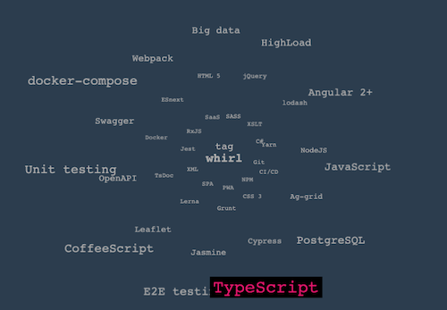

# TagWhirl

[](https://www.npmjs.com/package/@vkrepkiy/tagwhirl)

TagWhirl is a Web Component which allows to run complex but CPU friendly animation. CSS stylesheet for animation is calculated once when items are set, so there is no extra code execution. Though it was developed in a series of my free-time experiments, this package is mostly production ready.



## Installation

```bash
npm i -S @vkrepkiy/tagwhirl
```

## Basic usage example

```typescript
// Import module
import { TagWhirl } from "@vkrepkiy/tagwhirl";

// Register as custom element
customElements.define("tag-whirl", TagWhirl);

// Create element
const whirl = document.createElement("tag-whirl");

// Set items
whirl.items = [
  {
    text: "Tag 1",
    href: "http://link.to/my/first/tag", // optional
  },
  {
    text: "Tag 2",
    href: "http://link.to/my/second/tag", // optional
  },
  // ...etc
];

// Insert into document
document.querySelector("#someContainer").appendChild(whirl);
```
